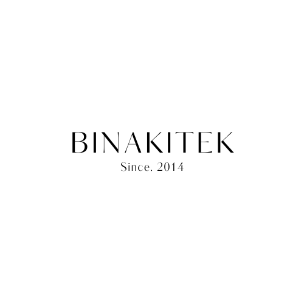
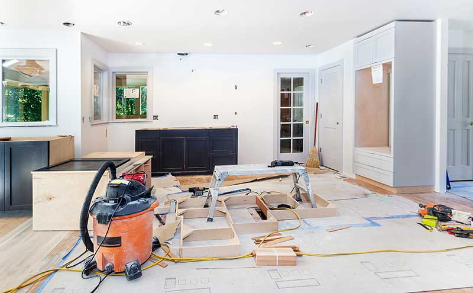
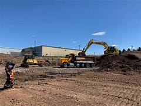

<!DOCTYPE html>
<html lang="en">
<head>
  <meta charset="UTF-8" />
  <meta name="viewport" content="width=device-width, initial-scale=1.0"/>
  <title>Binakitek</title>

  <!-- Custom CSS -->
  <link rel="stylesheet" href="style.css" />

  <!-- Font Awesome -->
  <link rel="stylesheet" href="https://cdnjs.cloudflare.com/ajax/libs/font-awesome/6.1.1/css/all.min.css"/>

  <!-- OwlCarousel (optional if needed) -->
  <link rel="stylesheet" href="https://cdnjs.cloudflare.com/ajax/libs/OwlCarousel2/2.3.4/assets/owl.carousel.min.css"/>
  <link rel="stylesheet" href="https://cdnjs.cloudflare.com/ajax/libs/OwlCarousel2/2.3.4/assets/owl.theme.default.min.css"/>
  <head>
	<link href="https://cdnjs.cloudflare.com/ajax/libs/font-awesome/6.0.0-beta3/css/all.min.css" rel="stylesheet">
  </head>
  
</head>
<body>
  

    <section class="home" id="home">
      <!-- Top Bar -->
      

        

          

            <i class="fa-solid fa-phone"></i> +03 000 0000
          

          

            <i class="fa-solid fa-envelope"></i> email@.com
          

          

            <a href="#"><i class="fa-brands fa-facebook-f"></i>facebook</a>
          

        

      

      <nav class="navbar">
        

          
        

        <ul class="nav-links">
          <li><a href="#home">Home</a></li>
          <li><a href="#about">About</a></li>
          <li><a href="#vision">Vision & Mission</a></li>
          <li><a href="#services">Services</a></li>
          <li><a href="#Company">company</a></li>
        </ul>
        

          
          
          
        

      </nav>
     <!-- Banner -->
<section class="home" id="home">
  

    

    

      <h1>BINAKITEK SDN BHD</h1>
      
Construction and Infrastructure Development Company

    

  

</section>

  <!-- Features Section -->
  <section class="features" id="about">
    <!-- Plain Text Content (No Box) -->
  

    <h2>Our Businesses</h2>
    
BINAKITEK SDN BHD is a locally-owned registered company operating in the construction and infrastructure development sector. We are committed to delivering high-quality services that meet industry standards, with a strong emphasis on safety, timely delivery, and client satisfaction.

    
We offer expertise in a variety of construction projects including commercial buildings, residential developments, civil engineering works, structural engineering, as well as renovation and maintenance services.

  

  <!-- Image Box -->
  

    

      
    

  

</section>

<!-- Vision & Mission Section -->
<section id="vision" style="background: url('vision mission.jpg') no-repeat center center fixed; background-size: cover; color: white; padding: 50px 20px; font-family: Arial, sans-serif;">
  

    
WHAT WE ASPIRE TO BE

    <h1 style="font-size: 48px; margin: 10px 0;">OUR VISION</h1>
    
To become a professional and competitive construction company at both national and international levels.

  

  

    
WHO WE ARE, WHAT WE DO

    <h1 style="font-size: 48px; margin: 10px 0;">OUR MISSION</h1>
    

      To provide high-quality, efficient, and safe construction services. 
      To improve operational efficiency through the use of technology and local expertise. 
      To establish strong and integrity-driven working relationships with clients and partners. 
      To foster sustainable and ethical development in every project undertaken.
    

  

</section>
<!-- Scope of Services Section -->
<section class="pro-services" id="services">
  

    <h2 class="section-title">Our Services</h2>
    

      

        

          
          

            <a href="building.html" class="read-more-btn">Read More</a>
          

        

        

          <h3>Building Construction</h3>
        

      

      

        

          
          

            <a href="engineering.html" class="read-more-btn">Read More</a>
          

        

        

          <h3>Civil Engineering Works</h3>
        

      

      

        

          
          

            <a href="renovation.html" class="read-more-btn">Read More</a>
          

        

        

          <h3>Renovation & Remodeling</h3>
        

      

      

        

          
          

            <a href="earthwork.html" class="read-more-btn">Read More</a>
          

        

        

          <h3>Earthworks & Site Preparation</h3>
        

      

      

      

        

          
          

            <a href="maintenance.html" class="read-more-btn">Read More</a>
          

        

        

          <h3>Infrastructure Maintenance</h3>
        

      

    

  

</section>

<section class="info-section" id="company">
  

    <h2>Company</h2>
    <ul class="company-info">
      <li><strong>Company Name:</strong> BINAKITEK SDN BHD</li>
      <li><strong>Registration Number:</strong> (Fill in if available)</li>
      <li><strong>Year Established:</strong> (Year)</li>
      <li><strong>Address:</strong> (Office Address)</li>
      <li><strong>Phone:</strong> (Phone Number)</li>
      <li><strong>Email:</strong> (Email Address)</li>
      <li><strong>Website:</strong> (Website URL)</li>
    </ul>
  

  

 <!-- middle image area -->

  

    

    <a href="#" class="read-more-btn">READ MORE</a>
    

      <button id="prevBtn">&larr;</button>
      <button id="nextBtn">&rarr;</button>
    

  

</section>

<footer class="footer">
  

    

      
      
Your Business • Our Passion

      

        <a href="#"><i class="fab fa-facebook-f"></i></a>
        <a href="#"><i class="fab fa-instagram"></i></a>
      

      
      
© 2025 Binakitek Sdn Bhd All Rights Reserved.

    

    

      <h4>Selangor</h4>
      

      
1-12B-12 & 1-12B-12A, Suntech @ Penang Cybercity, Lintang Mayang Pasir 3, 11950 Bayan Baru, Penang, Malaysia.

      
<strong>E:</strong> pg@binakitek.my <strong>T:</strong> +604–608 3321

      <h4 style="margin-top: 20px;">Kuala Lumpur</h4>
      

      
No. 22–1 Jalan Radin Bagus 3, Sri Petaling, 57000 Kuala Lumpur, Malaysia.

    

    

      <h4>Quick Links</h4>
      

      

        <ul>
          <li><a href="#home">Home</a></li>
          <li><a href="#about">About</a></li>
          <li><a href="#vision">Vision & Mission</a></li>
          <li><a href="#services">Services</a></li>
          <li><a href="#company">Company</a></li>
        </ul>
        <ul>
          <li><a href="#">Social Media</a></li>
          <li><a href="#">Blogs</a></li>
          <li><a href="#">Tutorials</a></li>
          <li><a href="#">Contact</a></li>
          <li><a href="#">KL & Selangor</a></li>
        </ul>
      

    

  

</footer>

<!-- JQuery -->

<!-- Owl Carousel -->

<!-- Custom Script -->

</body>
</html>
